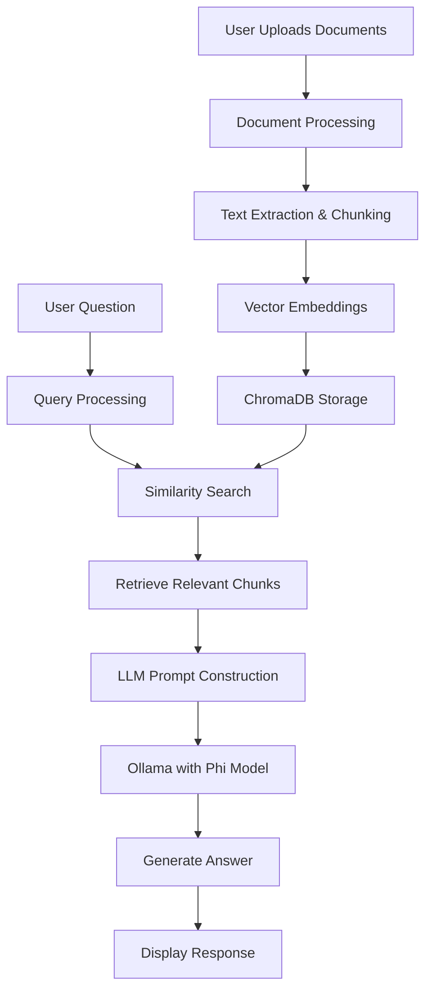

# 🤖 GIKI GPT

A powerful Retrieval-Augmented Generation (RAG) chatbot built with LangChain, Ollama, and Streamlit that can answer questions based on your uploaded documents (PDF, DOC, TXT, PPT).

## 🚀 Features

- **Multi-Format Support**: Process PDF, Word, Text, and PowerPoint files
- **Local LLM**: Uses Ollama with Phi model for local processing
- **RAG Architecture**: Retrieval Augmented Generation for accurate answers
- **Web Interface**: Beautiful Streamlit UI for easy interaction
- **CPU Compatible**: Optimized to run entirely on CPU
- **API Fallback**: Optional HuggingFace API integration

## 📋 Prerequisites

Before running this project, ensure you have:

- Python 3.10
- Ollama installed
- At least 4GB RAM (8GB recommended)
- 5+ GB free storage

## 🛠️ Installation

### 1. Clone the Repository

```bash
git clone https://github.com/zk405596-8986/Giki_Gpt.git
cd Giki_Gpt
```

### 2. Install Ollama

**Windows:**
- Download from [ollama.ai](https://ollama.ai/)
- Run the installer
- Open Command Prompt and verify installation:
  ```cmd
  ollama --version
  ```

**Linux/Mac:**
```bash
curl -fsSL https://ollama.ai/install.sh | sh
```

### 3. Download Phi Model

```bash
ollama pull phi
```

### 4. Set Up Python Environment

```bash
# Create virtual environment
python -m venv chat_env

# Activate environment (Windows)
chat_env\Scripts\activate

# Activate environment (Linux/Mac)
source chat_env/bin/activate

# Install dependencies
pip install -r requirements.txt
```

### 5. Configure Ollama (Optional but Recommended)

Create the Ollama config file:

```json
{
  "num_parallel": 4,     // CPU threads to use
  "num_keep": 2,         // Models to keep in memory
  "num_gpu": 0           // Force CPU usage (0 = no GPU)
}
```

### 6. Configure API Keys (Optional Fallback)

Create a `.streamlit/secrets.toml` file:

```toml
# .streamlit/secrets.toml
HF_API_KEY = "your-huggingface-api-key-here"
```

Get your HuggingFace API key from: [https://huggingface.co/settings/tokens](https://huggingface.co/settings/tokens)

## 🚀 Usage

### 1. Start Ollama Service

**First, open a terminal and start Ollama:**
```bash
ollama serve
```

**Keep this terminal open** - Ollama needs to be running for the chatbot to work.

### 2. Run the Application

**In a new terminal:**
```bash
# Activate environment (if not already active)
chat_env\Scripts\activate  # Windows
# source chat_env/bin/activate  # Linux/Mac

# Run the application
streamlit run giki_gpt.py
```

### 3. Use the Chatbot

1. **Open your browser** to `http://localhost:8501`
2. **Upload documents** (5 maximum) in the sidebar
3. **Click "Process Documents"**
4. **Start chatting** with your documents!

## 📁 Project Structure

```
giki-gpt/
├── giki_gpt.py          # Main application file
├── requirements.txt     # Python dependencies
├── chroma_db/          # Vector database (auto-created)
├── .streamlit/
│   └── secrets.toml    # API keys configuration
├── README.md           # This file
└── .gitignore          # Git ignore file
```

## 🔧 Architecture Overview



## 🧠 Models Used

### Primary Model:
- **Ollama with Phi**: Local, CPU-optimized language model
- **Model**: `phi` (Microsoft's Phi-2)
- **Size**: ~2.3GB
- **Type**: Transformer-based language model

### Embeddings Model:
- **Sentence Transformers**: `all-MiniLM-L6-v2`
- **Size**: ~90MB
- **Purpose**: Converts text to vector embeddings for similarity search

### Fallback Option:
- **HuggingFace Inference API**: Microsoft Phi-2
- **Requires**: Internet connection and API key

## 📊 Supported File Formats

| Format | Extension | Notes |
|--------|-----------|-------|
| PDF | `.pdf` | Text extraction only (no images) |
| Word | `.doc`, `.docx` | Full text content |
| Text | `.txt` | Plain text files |
| PowerPoint | `.ppt`, `.pptx` | Slide content extraction |

## ⚙️ Configuration

### Ollama Config (`~/.ollama/config.json`):
```json
{
  "num_parallel": 4,     // CPU threads to use
  "num_keep": 2,         // Models to keep in memory
  "num_gpu": 0           // Force CPU usage (0 = no GPU)
}
```

### Environment Variables:
```bash
CUDA_VISIBLE_DEVICES=-1  # Disable GPU
OLLAMA_NUM_GPU=0         # Force CPU for Ollama
```

## 🐛 Troubleshooting

### Common Issues:

1. **"Ollama connection refused"**
   - Ensure `ollama serve` is running in a separate terminal
   - Check if port 11434 is available

2. **"No connection could be made"**
   - Verify Ollama installation: `ollama --version`
   - Restart Ollama service

3. **"Memory error"**
   - Reduce chunk size in code (line 150)
   - Close other memory-intensive applications

4. **"Model not found"**
   - Download Phi model: `ollama pull phi`

5. **Slow performance**
   - The application is optimized for CPU but may be slower than GPU
   - Consider using fewer or smaller documents

### Performance Tips:

- Use text-based documents for faster processing
- Keep individual files under 10MB
- Process documents in batches if needed
- Ensure adequate RAM (8GB+ recommended)

## 📝 Usage Example

1. **Upload documents**: Research papers, manuals, or notes
2. **Ask questions**: "What are the main findings in document X?"
3. **Get answers**: Based on content from all uploaded files
4. **Chat naturally**: Follow-up questions maintain context

## 🤝 Contributing

We welcome contributions! Please:

1. Fork the repository
2. Create a feature branch
3. Make your changes
4. Add tests if applicable
5. Submit a pull request

## 📄 License

This project is licensed under the MIT License - see the LICENSE file for details.

## 🙏 Acknowledgments

- [Ollama](https://ollama.ai/) for local LLM support
- [LangChain](https://www.langchain.com/) for RAG framework
- [Streamlit](https://streamlit.io/) for web interface
- [Microsoft](https://www.microsoft.com/) for Phi model
- [HuggingFace](https://huggingface.co/) for embeddings and API

## 📞 Support

If you encounter any issues:

1. Check the troubleshooting section above
2. Search existing GitHub issues
3. Create a new issue with detailed information

## 🔄 Updates

Stay updated with the latest changes:

```bash
git pull origin main
pip install -r requirements.txt --upgrade
```

---

**Happy Chatting!** 🎉 If you find this project useful, please give it a ⭐ on GitHub!

---

